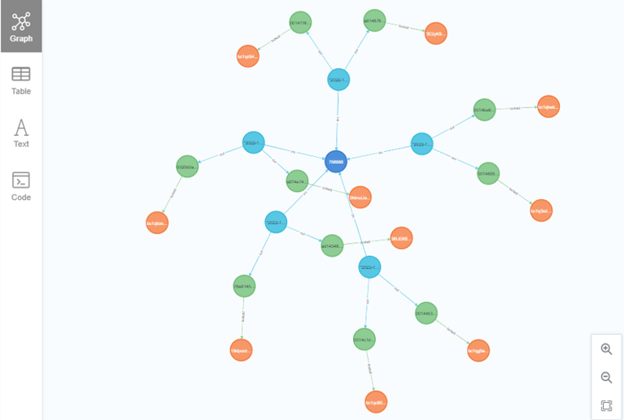

### Implémentation d’une BD graphe dans Neo4j - Données historiques de la blockchain Bitcoin

> :school: **Lieu de formation :** Université Paris Cité, Campus Grands Moulins (ex-Paris Diderot)
> 
> :books: **UE :** Base de données spécialisées 
> 
> :pushpin: **Année scolaire :** M2
> 
> :calendar: **Dates :** Novembre - décembre 2022 
> 
> :chart_with_upwards_trend: **Note :** ~16/20

#### Description
Le but de ce projet est de démontrer comment implémenter une base de données graphe avec un jeu de données de notre choix. Le jeu de données choisi est « Bitcoin Blockchain Historical Data » : données historiques complètes de la Blockchain Bitcoin.

**Remarque :** L'objectif principal de ce projet était de s'initier à Neo4j, et le choix du sujet a été fait malgré mon peu de compréhension des termes liés au Bitcoin lui-même. Il est donc possible que l’utilisation et l’interprétation de certains termes liés au Bitcoin soient inexactes. Cependant, je trouve le projet intéressant car il montre la puissance et l’intérêt d’utiliser une base de données graphe pour l'analyse des données historiques de la Blockchain Bitcoin.

#### Travail effectué
- Extraction des données depuis Google BigQuery.

- Importation des données dans Neo4j.

- Définition des contraintes d’intégrité.

- Requêtes en Cypher pour trouver des chemins entre des transactions et des adresses.

- Analyse de plans d’exécution.

- Démonstrations de l’application d’algorithmes tels que PageRank et Label Propagation sur les données.

- Démonstration d’une utilisation d’un client Python pour communiquer avec la base de données.

#### Ressources supplémentaires
- [Rapport](Rapport_FR.pdf)
